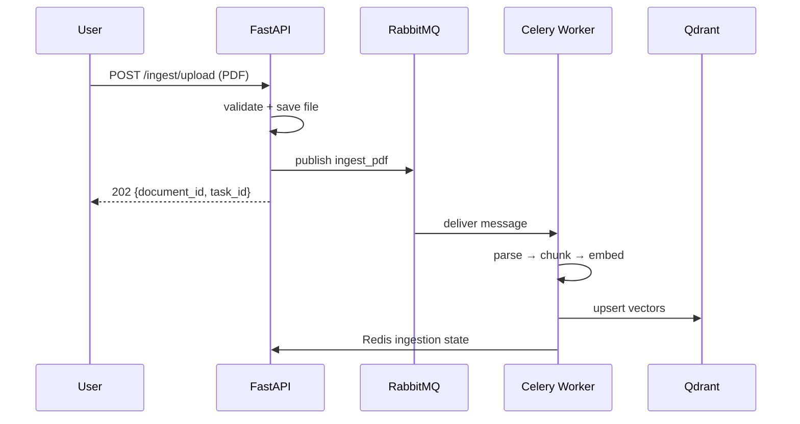
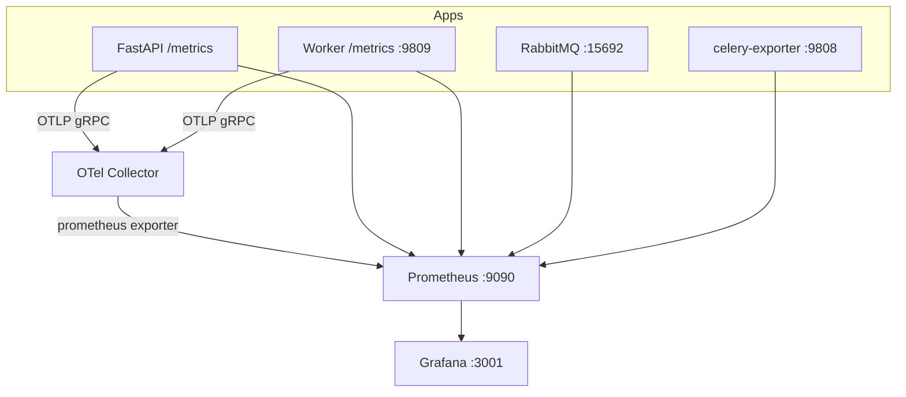

# Architecture

This document describes how the Multi-Agent RAG platform is structured, why key decisions were made, and where each **portfolio highlight** shows up in code.

---

## 1. Event-driven architecture

The system treats **work and side-effects as messages**, not synchronous RPC from the API thread.

| Event | Producer | Consumer | Queue |
|-------|----------|----------|-------|
| PDF ingestion job | `POST /ingest/upload` via `task_publisher.enqueue` | `ingest_pdf` Celery task | `pdf_ingestion_queue` |
| Chat analytics | `POST /chat/stream` (fire-and-forget) | `record_chat_analytics` | `chat_analytics_queue` |

**Design choices:**

- Upload returns immediately after the file is persisted and the task is **published** (with publisher confirms + bounded retries).
- Chat **read path** runs inline (embed → Qdrant → stream LLM) so answers are not blocked by ingestion backlog.
- Analytics publishing is **best-effort** and scheduled off the SSE hot path (`asyncio.create_task` + thread pool) so broker issues never break streaming.

Relevant code:

- `app/core/task_publisher.py` — durable publish with retry
- `app/api/routes/ingestion.py` — non-blocking upload
- `app/api/routes/chat.py` — decoupled analytics

---

## 2. RabbitMQ + Celery async processing

**Broker:** RabbitMQ (AMQP) with topology declared in `rabbitmq/definitions.json`:

- `pdf_ingestion_queue` — primary ingestion (DLX → `dead_letter_exchange`)
- `embedding_retry_queue` — TTL retry lane
- `dead_letter_queue` — poison / exhausted retries
- `chat_analytics_queue` — optional chat telemetry

**Workers:** Celery with JSON serialization, RabbitMQ broker, Redis result backend (`redis:6379/0`), cache/state on `redis:6379/1`.

**Celery configuration** (`app/core/celery_app.py`):

- `task_acks_late=True`
- `task_reject_on_worker_lost=True`
- `task_acks_on_failure_or_timeout=True`
- Explicit queue routing and task imports

---

## 3. Distributed worker orchestration

Services run as **separate containers** on a shared Docker network (`ragnet`):

| Container | Role |
|-----------|------|
| `api` | HTTP API, metrics, OTLP traces |
| `worker` | Celery consumer (`pdf_ingestion_queue`, `chat_analytics_queue`) |
| `rabbitmq` | Message broker |
| `redis` | Celery backend + ingestion/chat state |
| `qdrant` | Vector store |
| `frontend` | Static UI + nginx `/api` proxy |

**Orchestration details:**

- **Shared volume** `upload_data` mounted at `/data/uploads` on both `api` and `worker` so workers read the same files the API wrote.
- **Late acknowledgements** — a worker crash mid-task does not lose the message; it is redelivered to another consumer.
- **Flower** (`:5555`) for live worker/task inspection.
- **Worker metrics HTTP server** (`:9809`, multiprocess Prometheus registry) for embedding pipeline counters/histograms.

---

## 4. Production observability stack

**Metrics layers:**

| Layer | Examples |
|-------|----------|
| API (`app/core/metrics.py`) | upload latency, queue backlog gauge, chat active streams, time-to-first-token, Gemini request count |
| Worker (`app/core/worker_metrics.py`) | tasks received/processed, retries, DLQ count, embedding rate limits, Qdrant write failures |
| RabbitMQ plugin | queue depth, publish/ack rates, consumers |
| Celery exporter | task events → Prometheus |
| Tracing | OpenTelemetry instrumentation on FastAPI + Celery |

**Grafana dashboards** (auto-provisioned):

- `rabbitmq.json` — depth, consumers, publish/ack rates, DLQ growth
- `worker.json` — throughput, retries, embedding pipeline
- `chat.json` — streams, latency, tokens, retrieval hits
- `api-overview.json` — API + Celery overview

---

## 5. Streaming LLM responses

**Endpoint:** `POST /chat/stream` — Server-Sent Events (SSE).

**Flow:**

1. Embed user query (`embed_query` → Gemini or deterministic fallback).
2. `query_points` against Qdrant collection.
3. Build grounded prompt from retrieved chunks.
4. `stream_generate` — yields tokens; each token is an SSE `data: {"type":"token","text":"..."}` frame.
5. Final `done` event includes latency, token usage, provider, retrieval hit count.

**Frontend:** `frontend/src/api/chat.ts` parses SSE frames; `StreamingMessage` + `TypingIndicator` render incremental output.

**nginx:** `frontend/nginx.conf` disables proxy buffering for `/api/` so tokens are not batched at the edge.

---

## 6. Resilient retry mechanisms

### API → broker (publish path)

`task_publisher.enqueue` retries broker failures with exponential backoff (`settings.publish_max_retries`). Failures surface as `BrokerPublishError` (503) without hanging the event loop.

### Worker → external services (task path)

`ingest_pdf` (`app/tasks/ingestion_tasks.py`):

| Failure class | Behavior |
|---------------|----------|
| Transient (rate limit, Qdrant write, soft timeout) | Celery `retry` with `_backoff_countdown` (exponential + jitter), up to `max_retries=5` |
| Permanent (malformed PDF, missing file) | `Reject(requeue=False)` → DLQ via RabbitMQ DLX |
| Retry exhausted | DLQ + Redis state `DEAD_LETTER` |

Backoff uses full jitter between `ceiling/2` and `ceiling` seconds to reduce thundering herds.

### RabbitMQ topology

Queues declare `x-dead-letter-exchange` → `dead_letter_exchange` → `dead_letter_queue`. Policies on ingestion/retry queues enforce DLX routing.

---

## Failure simulations (E2E)

`scripts/e2e_test.sh` validates:

- Happy path: upload → ingest → Qdrant index → chat → SSE stream
- Malformed PDF → DLQ
- RabbitMQ restart during ingestion → worker recovery
- Consumer crash → message not lost (`acks_late`)
- Qdrant outage → retries → DLQ on exhaustion

Run: `make e2e` or `make e2e-fast`.

---

## API surface (summary)

| Method | Path | Description |
|--------|------|-------------|
| `POST` | `/ingest/upload` | Multipart PDF upload → queue |
| `GET` | `/ingest/{document_id}` | Ingestion status (Redis + Celery) |
| `GET` | `/tasks/{task_id}` | Celery task status (frontend tracker) |
| `POST` | `/chat/stream` | SSE streaming RAG answer |
| `POST` | `/chat` | JSON RAG answer (non-streaming) |
| `GET` | `/health/ready` | RabbitMQ + Redis + Qdrant readiness |
| `GET` | `/metrics` | Prometheus scrape endpoint |

---

## Security & production notes (local vs real prod)

This repo targets a **local production-grade** stack for learning and portfolio demos. For real production you would additionally consider:

- TLS termination, secrets management, non-default credentials
- AuthN/Z on API and Grafana
- Horizontal scaling of workers with autoscaling on queue depth
- Managed RabbitMQ / Redis / vector DB
- SLOs, alerting (PagerDuty), and log aggregation (Loki/ELK)

The patterns above (events, retries, DLQ, observability, streaming) transfer directly to those environments.
