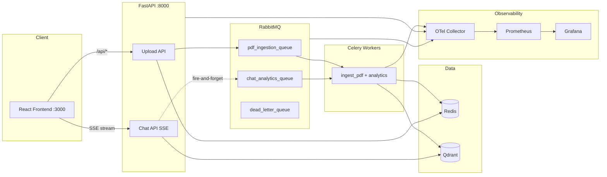

# Multi-Agent RAG — Event-Driven Knowledge Assistant

A **production-style**, containerized **Retrieval-Augmented Generation (RAG)** platform: upload PDFs, embed them asynchronously, and chat with **streaming, grounded** answers backed by your documents.

Built to demonstrate real distributed-systems patterns — not a single-process demo.

---

## Architecture highlights

| Capability | Implementation |
|------------|----------------|
| **Event-driven architecture** | Upload and analytics paths publish messages to RabbitMQ; API stays non-blocking |
| **RabbitMQ + Celery async processing** | Durable `pdf_ingestion_queue`, JSON tasks, Redis result backend |
| **Distributed worker orchestration** | Separate API and Celery worker containers, shared upload volume, `acks_late` |
| **Production observability stack** | OpenTelemetry → Prometheus → Grafana (+ RabbitMQ & Celery exporters) |
| **Streaming LLM responses** | SSE (`POST /chat/stream`) from Gemini through FastAPI to React |
| **Resilient retry mechanisms** | Exponential backoff + jitter, DLQ routing, bounded API publish retries |

See **[ARCHITECTURE.md](./ARCHITECTURE.md)** for diagrams, queue topology, and failure-handling detail.  
See **[docs/PORTFOLIO.md](./docs/PORTFOLIO.md)** for LinkedIn copy and demo talking points.

---

## System overview



**Write path:** PDF upload → validate → persist → publish Celery task → parse/chunk/embed (Gemini) → upsert Qdrant  
**Read path:** query → embed → vector search → grounded prompt → **stream** Gemini tokens (independent of ingestion queue)

---

## Quick start

### Prerequisites

- Docker & Docker Compose
- Optional: `GEMINI_API_KEY` in `.env` for live embeddings/chat (deterministic fallback without it)

```bash
cp .env.example .env
# Edit .env — set GEMINI_API_KEY if you have one

make up          # build + start full stack
make verify      # RabbitMQ queues + Prometheus targets
make e2e         # end-to-end + failure simulations
```

### Service URLs (defaults)

| Service | URL | Purpose |
|---------|-----|---------|
| **Frontend** | http://localhost:3000 | Upload UI + streaming chat |
| **API** | http://localhost:8000/docs | OpenAPI / REST |
| **RabbitMQ** | http://localhost:15672 | Management UI (`guest` / `guest`) |
| **Grafana** | http://localhost:3001 | Dashboards (`admin` / `admin`) |
| **Prometheus** | http://localhost:9090 | Metrics explorer |
| **Flower** | http://localhost:5555 | Celery task monitor |
| **Qdrant** | http://localhost:6333/dashboard | Vector DB UI |

> Grafana uses **3001** so the frontend can own **3000**.

---

## Features

- **Multi-PDF upload** — drag-and-drop, progress, processing status (`Queued → Uploading → Processing → Indexed`)
- **Async ingestion** — RabbitMQ + Celery with retries, DLQ for poison messages
- **RAG chat** — retrieval from Qdrant, source citations, token-by-token SSE streaming
- **Decoupled analytics** — chat events published to a side queue without blocking streams
- **Observability** — queue depth, DLQ growth, worker throughput, chat latency, Gemini API calls
- **E2E validation** — `scripts/e2e_test.sh` (happy path + broker restart, consumer crash, retry exhaustion)

---

## Project layout

```
Multi-Agent_RAG/
├── app/                    # FastAPI + Celery tasks
│   ├── api/routes/         # health, ingest, chat, tasks
│   ├── core/               # broker, embeddings, RAG, metrics, telemetry
│   └── tasks/              # ingestion_tasks, analytics_tasks
├── frontend/               # React + Vite + Tailwind (nginx in Docker)
├── rabbitmq/               # definitions.json (queues, DLX, bindings)
├── prometheus/             # scrape config
├── grafana/dashboards/     # rabbitmq, worker, chat, api-overview
├── otel/                   # collector config
├── scripts/e2e_test.sh     # pipeline + failure simulations
├── docker-compose.yml
├── ARCHITECTURE.md
└── docs/PORTFOLIO.md
```

---

## Makefile

```bash
make help       # all targets
make up         # docker compose up -d --build
make down       # stop (keep volumes)
make clean      # stop + delete volumes
make logs       # tail all services
make queues     # rabbitmqctl list_queues
make verify     # queues + Prometheus target health
make e2e        # full E2E suite
make e2e-fast   # E2E without slow retry-exhaustion test
```

---

## Tech stack

**Backend:** Python 3.12 · FastAPI · Celery · RabbitMQ · Redis · Qdrant · Google Gemini · pypdf · OpenTelemetry · Prometheus  

**Frontend:** React 19 · TypeScript · Vite · Tailwind CSS · Zustand · Axios  

**Infra:** Docker Compose · nginx (frontend reverse proxy + SSE) · Grafana · Flower · celery-exporter

---

## Configuration

Copy `.env.example` → `.env`. Key variables:

| Variable | Description |
|----------|-------------|
| `GEMINI_API_KEY` | Live Gemini embeddings + chat (optional) |
| `EMBEDDING_MODEL` | e.g. `models/gemini-embedding-001` |
| `GEMINI_CHAT_MODEL` | e.g. `gemini-2.5-flash` |
| `FRONTEND_PORT` | Default `3000` |
| `GRAFANA_PORT` | Default `3001` |

---

## License

MIT (or your choice — add a `LICENSE` file if publishing publicly).
